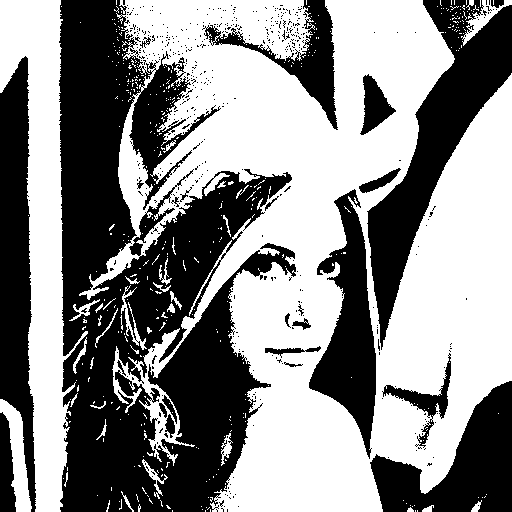

# Color -> Grey -> Binary

Esta pasta é o projeto numero 2: um conversor de imagens de RGB para escala de cinza e, por fim, para binário.

Para alterar a imagem desejada, apenas mudar o path na variável `path`

- Imagem original:

- Imagem escala de cinza:

- Imagem binária (preto e branco):
